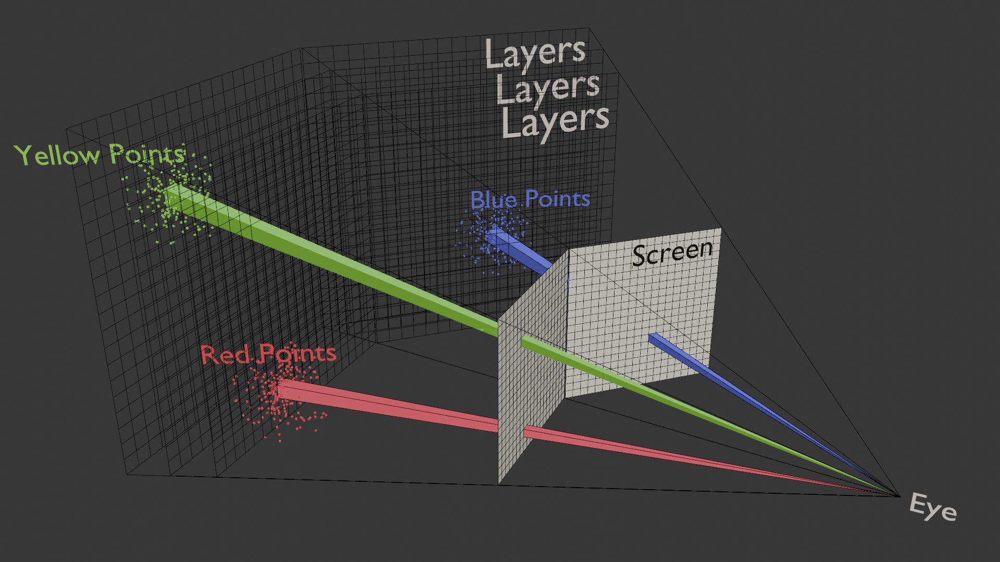

# Multi-screen splicing display model

*[HoloLab](http://www.holoddd.com/), Tsinghua University*

 <strong>Figure 1</strong>.The multi-screen splicing model uses a perspective view, where the position of the viewpoint is very important. The relative position of the viewpoint to different screens is different, and parameters need to be transformed during the mapping process to meet the requirements of the stereoscopic effect. 

This model primarily achieves a 3D presentation effect of point cloud maps on the splicing screen. It mainly uses a layer-by-layer loading method for mapping point cloud projections onto the screen, segmenting the point cloud, and constructing perspective mapping relationships for each segment.

## Reference
Matlab 2019b or newer. Older visions may be sufficient but have not been tested.

## Quick Start
- **Splicing screen effect demonstration.** [`demo`](https://github.com/jding23/naked-eye/edit/main/coding/demo) includes two types of demonstrations: dual-screen splicing and three-screen splicing.
